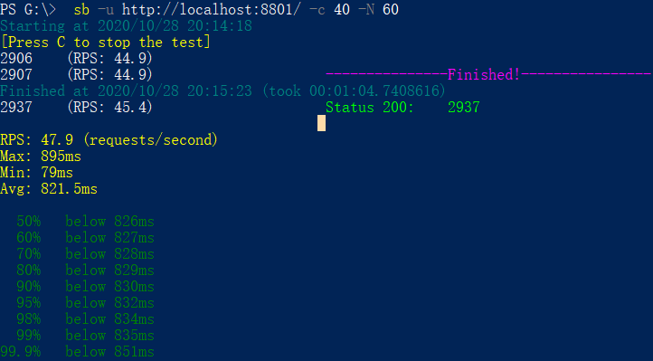
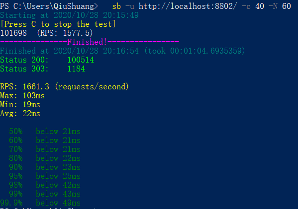
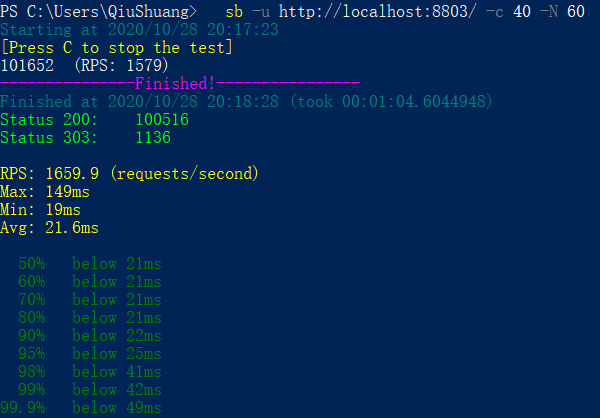
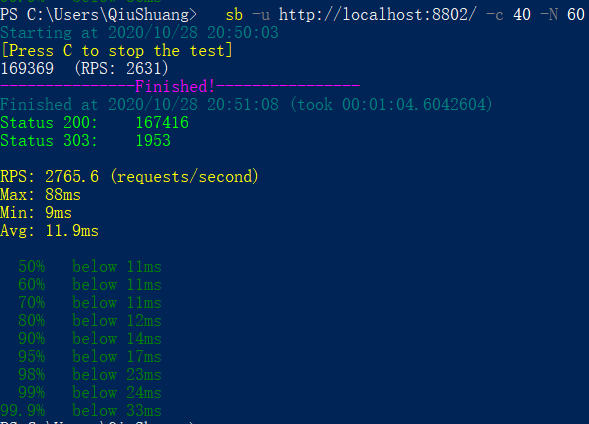
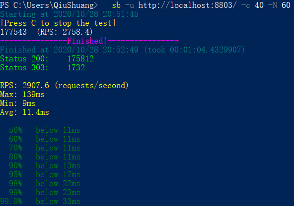
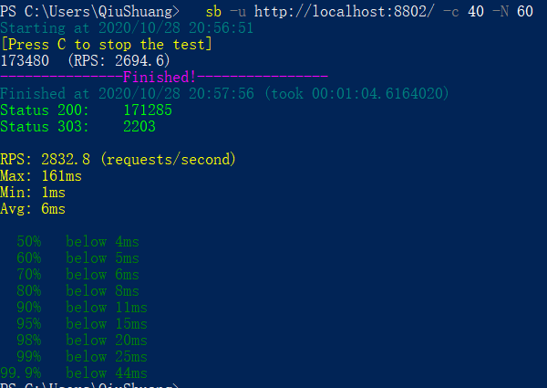
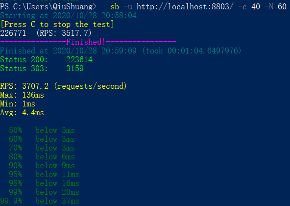
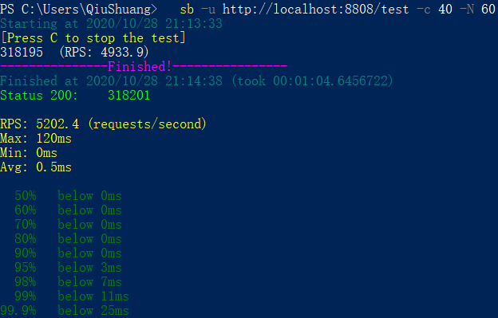

学习笔记

### 1、使用 GCLogAnalysis.java 自己演练一遍串行/并行/CMS/G1的案例

### 2、使用压测工具（wrk或sb），演练gateway-server-0.0.1-SNAPSHOT.jar 示例

根据上述自己对于1和2的演示，写一段对于不同 GC 的总结，提交到 Github

环境：win10 内存24G CPU核心数4逻辑处理器8

**对于串行GC而言**：当堆内存太小时，由于没有足够多的内存供新创建的对象使用，会导致内存溢出（内存分配速率持续大于内存回收速率）；随着堆内存的增加，无论是年轻代GC还是Full GC，其次数都会减少（当内存不足时才会触发GC行为），但是由于是单线程回收，单次GC的时间会随着堆内存的增大而增加；年轻代GC仅回收Eden区和S0区，将存活的对象复制到S1,并将部分对象晋升到老年代，正常情况下可以回收百分之八九十的内存，采用标记-复制算法；Full GC因为只有单个回收线程，仅回收老年代内存，老年代根据分代思想一般情况下仅能回收很少比例的内存，采用标记-清除-整理算法。

**对于并行GC而言**：由于是并行垃圾回收，在进行垃圾收集时所有的CPU都被垃圾收集线程所使用，吞吐量最高。与串行GC相比，无论是年轻代GC还是Full GC，单次GC所耗费的时间都更短；并行GC的年轻代GC与串行GC相同，仅回收Eden区和S0区，将存活的对象复制到S1,并将部分对象晋升到老年代，正常情况下可以回收百分之八九十的内存，采用标记-复制算法；并行GC的Full GC不同于串行GC，年轻代和老年代都会回收，而且年轻代的内存会全部回收，老年代的回收比例也比较低，采用标记-清除-整理算法。当堆内存太小时，与串行GC相同，均会内存溢出；随着堆内存的增加，无论是年轻代GC还是Full GC，其次数都会减少。

**对于CMS GC而言：**当堆内存太小时，与前两者相同，均会内存溢出；CMS GC的年轻代GC（多线程版本的SerialGC，即ParNew）与前两者相同，仅回收Eden区和S0区，将存活的对象复制到S1,并将部分对象晋升到老年代，正常情况下可以回收百分之八九十的内存，采用标记-复制算法；Full GC则由CMS垃圾收集器进行收集，仅回收老年代内存，仅初始标记和最终标记需要STW，其他阶段都与业务线程并发执行，采用标记-清除算法，故随着时间的推移会出现内存碎片问题。Full GC单次所消耗的时间比并行GC少，但频率会更高，总体吞吐量不如并行GC，而且老年代一旦进行内存整理，单次GC的时间会很长，耗时不可控。

**对于G1 GC而言**：G1垃圾收集器不再像前面三种垃圾收集器把年轻代和老年代的大小固定，而是将整个堆默认分为2048个region，G1的目标是保证GC暂停时间的可配置与可控，其整体吞吐量一般在并行GC和CMS之间，而单次暂停时间一般也是在并行GC和CMS之间，不过随着内存增大（4G到几十G），其相对于前两者的优势越明显，一般会选择G1 GC。G1有两种Evacuation Pause（转移暂停），纯年轻代和混合模式，前者与CMS以及并行GC的年轻代GC相同，仅回收年轻代内存；而混合模式下，会回收年轻代和部分老年代内存。G1的单个region有时是年轻代，有时是老年代，有时又是survivor，并不是固定的。每次回收内存，选择多少个region与设定的回收时间等诸多因素有关，充分体现了G1的GC停顿可配置。G1还有一个并发标记阶段，与CMS类似大部分步骤是并发进行的。

### 1、（可选）运行课上的例子，以及 Netty 的例子，分析相关现象。









第一张图片是单个线程处理socket请求，虽然并发请求数设置的是40，但是每个请求必须等上一个请求处理完（20ms业务时间），并且服务器端继续监听，才能被服务器响应。

第二张图是每个请求一个线程，由于每个请求都是新创建一个线程进行处理，理论上不会存在一个请求需要等另一个请求处理完，故相比第一张图的RPS要快上40倍了。

第三张图是首先创建固定大小的线程池，然后每个请求都交给线程池去处理，这里的结果与老师PPT上的结果是有出入的。在本机上多次压测每个请求一个线程和固定大小线程池处理，都发现前者的RPS都要略高于后者，固定大小的线程池从40个改成80个也是如此。推测Java中的线程对象虽然为重量级对象，但是相对于恒定的业务处理所需要的时间（20ms）而言，创建Java线程对象的时间开销还是小一点。于是，将业务处理时间20ms降至10ms，如下两图为每个请求一个线程和固定大小线程池处理的结果，此时固定大小线程池处理已经优于每个请求一个线程。





再进一步降低业务处理时间为2ms，如下两图为每个请求一个线程和固定大小线程池处理的结果，创建Java对象的开销已经很明显了。






如下为netty的例子，妥妥地RPS更高。仔细看代码发现netty例子中并无业务20ms时间，尝试将固定大小线程池处理的代码中睡眠20ms去掉，结果RPS只有2500左右反而下降了（相比睡眠2ms）。比较意外，推测所有的请求都阻塞在网卡上了?可见netty确实优秀得多。




2、写一段代码，使用 HttpClient 或 OkHttp 访问 http://localhost:8801，代码提交到
Github。

```
import okhttp3.OkHttpClient;
import okhttp3.Request;
import okhttp3.Response;

public class OkHttpUtil {
    /**
     * Get请求
     * @param url   URL地址
     * @return  返回结果
     */
    public static String get(String url){
        String result=null;
        try {
            OkHttpClient okHttpClient=new OkHttpClient();
            Request request = new Request.Builder().url(url).build();
            Response response = okHttpClient.newCall(request).execute();
            result=response.body().string();
            return result;
        }catch (Exception e){
            e.printStackTrace();
            return result;
        }
    }

    public static void main(String[] args) {
        String result = get(" http://localhost:8801");
        System.out.println("the result is:"+result);
    }
}
```
